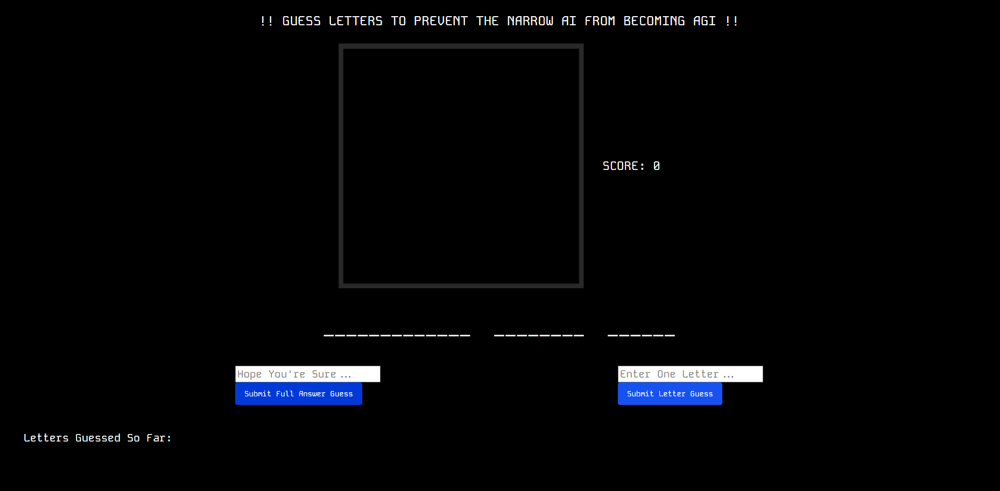
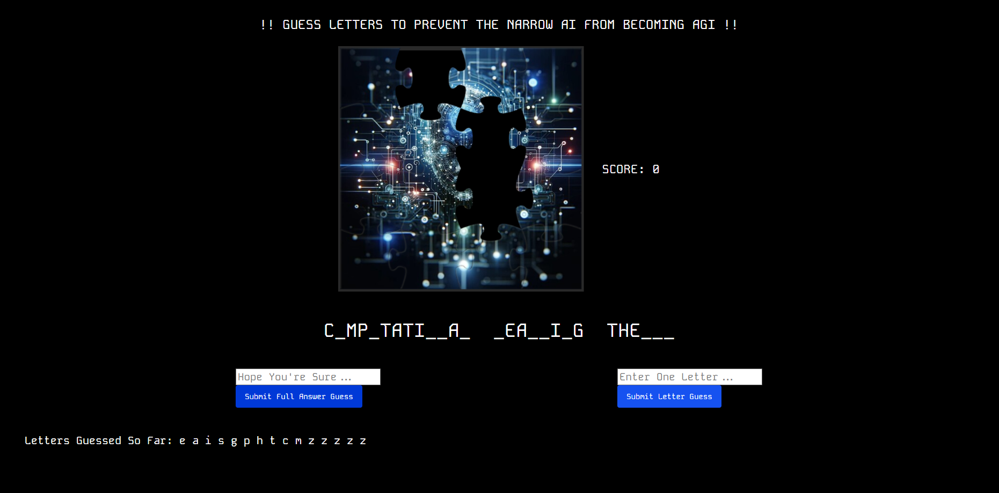
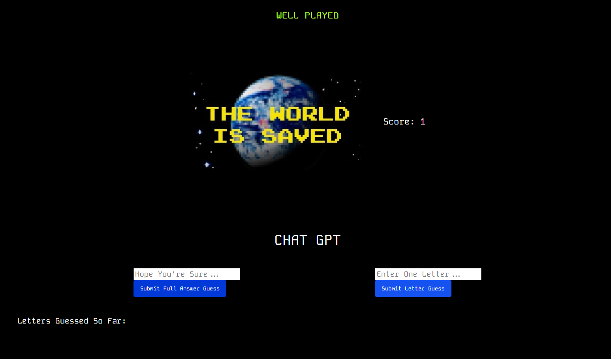
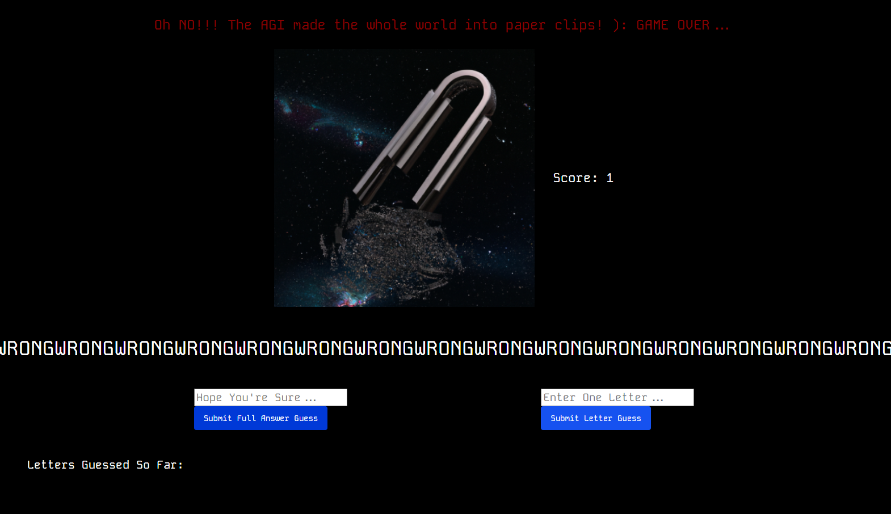

# PAPERCLIP MINIMIZER
A spaceman/hangman type game with a theme of AI Safety. Guess the words before the Narrow AI assembles into an AGI (Artificial General Intelligence) and wipes out civilization as we know it! You can guess letters or the full answer, but be careful, guessing the full answer incorrectly results in instantly losing the game and the world.

# Screenshots

  
Game start    
  
Mid game    
  
Game won    
  
Game lost    

# Technologies Used

- JavaScript
- HTML
- CSS

# Getting Started

https://jamesonhussey.github.io/paperclip-minimizer/

# Next Steps

- Bomb - costs two lives unless full word is guessed. Guesses all letters around the target letter on the keyboard. Example: Bomb targets G - the letters G, T, Y, H, B, V, and F are guessed. Two lives are removed (even if one or more letters match, as long as full answer is not completed).

- Laser - Laser - costs one life unless full word is guessed. Guesses letters in a right diagonal line including the target letter. Example: Laser targets G - the letters G, T, and B are guessed. One life is removed (even if one or more letters match, as long as full answer is not completed).

- Possibly move "Letters Guessed So Far: " to under "SCORE" element, and have letters fill in blanks in a keyboard-like setup so player can see the effect of items as they are used.

- Word Bank Mode - Every time the player guesses a word, they are awarded with credits. Item shop is on the side of the screen where player can buy items such as the bomb, laser, and extra lives. Lives stay the same through different words (if you lose a life, you're still down a life when the next word appears), and items can be used without losing lives (since they cost credits).
 